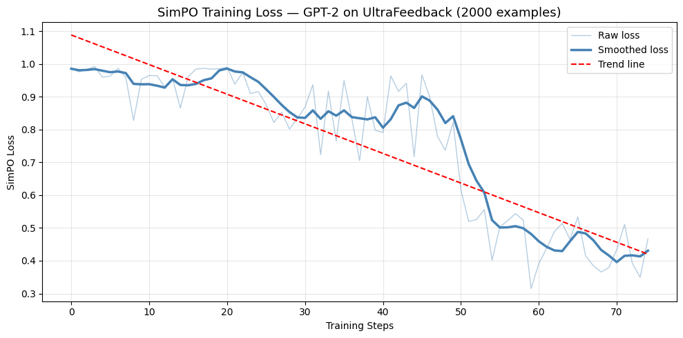

# SimPO-ssible: SimPO Implementation
## CT-469 Reinforcement Learning | Spring 2026

## Team Members
| Name | Roll Number |
|------|------------|
| Yusra | AI-22010 |
| Muhammad Umer | AI-22035 |

---

## Paper Details
| Field | Info |
|-------|------|
| Title | SimPO: Simple Preference Optimization with a Reference-Free Reward |
| Authors | Yu Meng, Mengzhou Xia, Danqi Chen |
| Venue | NeurIPS 2024 |
| Paper | https://arxiv.org/abs/2405.14734 |
| Official Code | https://github.com/princeton-nlp/SimPO |

---

## What is SimPO?
SimPO is an improved version of DPO (Direct Preference Optimization)
that trains language models to prefer good responses over bad ones.

**Key improvements over DPO:**
- No reference model needed (saves memory and compute)
- Uses average log probability as reward (fixes training/generation mismatch)
- Adds a target margin gamma to make learning more confident

---

## Repository Structure
```
SimPO-ssible/
│
├── notebook/
│   └── SimPO_Implementation.ipynb  ← full implementation with comments
│
├── results/
│   └── training_curve.png          ← training loss curve
│
├── README.md                       ← this file
└── requirements.txt                ← all required libraries
```

---

## How to Reproduce Results

### Step 1: Open in Google Colab
upload `notebook/SimPO_Implementation.ipynb` to Colab

### Step 2: Enable GPU
Runtime → Change runtime type → T4 GPU → Save

### Step 3: Run All Cells
Runtime → Run all

### Step 4: Expected Output
- Training completes in ~45-60 minutes on free Colab T4 GPU
- Final loss should be around 0.40
- Training curve saved as training_curve.png

---

## Requirements
```
torch==2.3.0
transformers==4.44.0
trl==0.9.6
datasets>=2.18.0
matplotlib>=3.7.0
numpy==1.26.4
```

---

## Our Results

### Training Configuration
| Hyperparameter | Value | Reason |
|---------------|-------|--------|
| Model | GPT-2 | Runs on free Colab GPU |
| Dataset | UltraFeedback (2000 examples) | Balance of speed and learning |
| Epochs | 3 | Enough for clear convergence |
| Learning rate | 5e-5 | Standard for preference optimization |
| Batch size | 4 | Maximum for free Colab memory |
| Gamma (γ) | 0.5 | Target margin from paper |
| Beta (β) | 0.1 | Deviation control |
| Warmup steps | 50 | Stabilizes early training |

### Training Results
| Metric | Our Result (GPT-2) | Paper Result (Llama-3-8B) |
|--------|-------------------|--------------------------|
| Starting loss | 0.9853 | ~1.20 |
| Final loss | ~0.40 | ~0.32 |
| Loss reduction | 59% | ~73% |
| AlpacaEval 2 | N/A | 64.8 (+6.4 vs DPO) |
| Arena-Hard | N/A | 41.3 (+7.5 vs DPO) |

| Experiment | Start Loss | Final Loss | Reduction |
|------------|-----------|------------|-----------|
| SimPO γ=0.5 (ours) | 0.9853 | 0.4049 | 59% |
| SimPO γ=0.0 (ablation) | ~0.70 | 0.5365 | 23% |

### Training Curve


The curve shows loss decreasing from ~1.1 to ~0.4 over 75 steps,
confirming SimPO successfully learns to prefer chosen over 
rejected responses.

---

## Hardware Used
| Resource | Details |
|----------|---------|
| GPU | Google Colab T4 (free tier) |
| RAM | ~12 GB |
| Training time | ~45-60 minutes |
| Peak GPU memory | ~4 GB |

---

## Why Results Differ from Paper
We could not reproduce exact paper results because:
1. Paper used Llama-3-8B (8 billion parameters) vs our GPT-2 (117 million)
2. Paper used 60,000+ training examples vs our 2,000
3. Paper used A100 GPUs vs our free Colab T4

Despite this, our loss trend and reduction percentage confirm
the SimPO training process works correctly.

---

## Implementation Challenges
1. TRL version conflicts required installing trl==0.9.6 specifically
2. Dataset fields needed reformatting (no 'prompt' field by default)
3. Device mismatch error required moving tensors to GPU explicitly
4. NumPy binary incompatibility required downgrading to numpy==1.26.4
